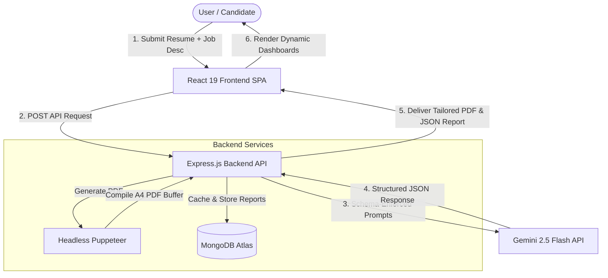

# HireFrnd 🚀
### *The Intelligent AI-Powered Resume Optimizer & Interview Preparation Engine*

**HireFrnd** is a full-stack, enterprise-ready career intelligence suite designed to bridge the gap between candidates and recruiters. Built with a modern architecture leveraging **React 19**, **Node.js/Express**, and **MongoDB**, it integrates the **Gemini 2.5 Flash API** to dynamically analyze, tailor, and compile professional resumes while generating comprehensive, customized interview prep guides.

---

## 🛠️ System Architecture & Workflow

Here is how the data flows through HireFrnd to deliver deterministic AI insights and pixel-perfect PDF resumes:



---

## ✨ Key Features

- 📄 **Dynamic Resume Tailoring:** Leverages advanced prompting to align candidate skills, projects, and achievements directly with a target job description.
- 🖨️ **Server-Side PDF Generation:** Utilizes headless Puppeteer on the backend to render resumes into clean, professional, single-page A4 PDFs with absolute styling consistency.
- 📊 **Interview Prep Dashboard:** Automatically evaluates the candidate's profile against the job description to generate:
  - **Match Score (0-100%)** indicating role alignment.
  - **Interviewer-Motivated Questions:** Both technical and behavioral questions mapped with the underlying interviewer intent, recommended talking points, and potential pitfalls.
  - **Skill-Gap Analysis:** Severity-classified skill gaps (Low/Medium/High) to address before the interview.
  - **Day-by-Day Prep Plan:** Structured daily tasks and focus areas leading up to the interview date.
- 🔐 **Robust Authentication:** Secure authentication pipeline using JWT stored in **HTTP-Only cookies** and server-side logout token blacklisting.

---

## 💻 Tech Stack

| Category | Technology | Purpose |
| :--- | :--- | :--- |
| **Frontend** | React 19, React Router 7, Vite | Fast, modern SPA routing and responsive client state |
| **Backend** | Node.js, Express.js | Scalable REST API architecture and middleware pipelines |
| **Database** | MongoDB, Mongoose | Flexible document storage for user profiles, resumes, and report cache |
| **Generative AI** | Gemini 2.5 Flash (`@google/genai`) | High-speed semantic analysis and report generation |
| **Validation** | Zod, Zod-to-JSON Schema | Enforces strict type checking and structure at runtime and API layers |
| **Automation** | Puppeteer | Headless browser automation for high-fidelity A4 PDF rendering |
| **Security** | JWT, Bcrypt.js, Cookie-Parser | Secure authentication, password hashing, and cookie management |

---

## ⚡ Technical Highlights & Engineering Decisions

### 1. Eliminating AI Hallucinations via Schema-Enforced Generation
Large Language Models are inherently non-deterministic. To prevent malformed text output from breaking frontend parsers, HireFrnd implements **Zod schemas** passed directly to the Gemini API via the `@google/genai` SDK config. This forces the model to respond strictly in a structured JSON format matching our data models (`resumeResponseSchema` and `interviewReportSchema`), guaranteeing 100% database schema compatibility.

### 2. Standardized Server-Side PDF Rendering
Traditional client-side HTML-to-PDF tools are prone to rendering mismatches caused by different operating systems, client browser configurations, and missing local fonts. We solved this by offloading the rendering engine to **Puppeteer** on the backend. This guarantees that all resumes render in a uniform, controlled sandbox, utilizing standard fonts, precise page heights, and producing print-ready, single-page A4 PDFs.

### 3. Bulletproof JWT Token Security
To defend against Cross-Site Scripting (XSS) attacks, user session tokens are kept out of localStorage and instead stored in **HTTP-Only cookies**. Additionally, a blacklist mechanism is implemented to invalidate tokens on the server immediately upon logout, reducing replay-attack vectors.

---

## 📂 Project Structure

```text
hirefrnd/
├── backend/
│   ├── src/
│   │   ├── config/          # Database & configuration loaders
│   │   ├── controllers/     # API request handlers (Auth, Resume, Interview)
│   │   ├── middlewares/     # Authentication & request validation (Zod)
│   │   ├── models/          # Mongoose DB models (User, Resume, InterviewReport)
│   │   ├── routes/          # Express API route endpoints
│   │   ├── services/        # AI orchestration (Gemini) & Puppeteer rendering
│   │   └── server.js        # Main API entry point
│   ├── Dockerfile
│   └── package.json
└── frontend/
    ├── src/
    │   ├── features/        # Component folders grouped by domains (auth, interview, resume)
    │   ├── styles/          # Sass styling assets
    │   ├── app.routes.jsx   # SPA route definitions (React Router 7)
    │   └── main.jsx         # Application entry
    ├── vite.config.js
    └── package.json
```

---

## 🚀 Getting Started

### Prerequisites
- Node.js (v18+)
- MongoDB (Local instance or Atlas Connection URI)
- Gemini API Key (Get one from Google AI Studio)

### Installation

1. **Clone the Repository:**
   ```bash
   git clone https://github.com/aashaykk/hirefrnd-proj.git
   cd hirefrnd-proj
   ```

2. **Configure Environment Variables:**
   Create a `.env` file in the `backend/` directory:
   ```env
   PORT=5000
   MONGO_URI=your_mongodb_connection_string
   JWT_SECRET=your_jwt_signing_key
   GOOGLE_GENAI_API_KEY=your_gemini_api_key
   ```

3. **Start the Backend Server:**
   ```bash
   cd backend
   npm install
   npm run dev
   ```

4. **Start the Frontend Dev Server:**
   ```bash
   cd ../frontend
   npm install
   npm run dev
   ```
   *The frontend application will boot up at `http://localhost:5173`.*

---

## 🔮 Future Enhancements
- **Browser Automation Hook:** Automate the parsing of job details directly from job portals (like LinkedIn or Indeed) using Puppeteer web scrapers.
- **Resource pooling for Puppeteer:** Integrate a browser instance pooler to reuse Puppeteer processes and optimize server memory allocation.
